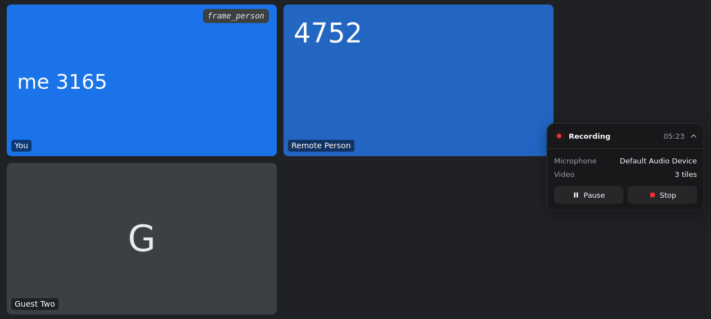

# Zen Recorder

**Records your Google Meet, Zoom and Microsoft Teams calls to files on your own disk, with notes
an AI assistant can read.** A browser add-on for Firefox, Zen and the other Firefox-based browsers.

[Install](#install) · [Features](#features) · [Services and browsers](#services-and-browsers) ·
[Privacy](#privacy) · [FAQ](#faq) · [User guide](docs/user-guide.md) ·
[Contributing](#contributing)



<sub>The status card in a call, on the project's test meeting page (the names are invented).</sub>

Each meeting becomes two files: the recording (everyone's audio, your microphone, and the video
tiles and shared screen laid out as you see them) and its notes (what the meeting was and what
happened, with times that point into the recording). An assistant reads the notes, then the
recording, and does not have to guess. Nothing leaves your machine: no servers, no accounts, no
uploads, no telemetry.

> Zen Recorder is an independent project. It is not affiliated with, endorsed by or sponsored by
> Zen Browser or its team. The maintainer uses Zen Browser, which is why the recorder targets
> Firefox-based browsers.

## Install

You need Firefox 140 or later, or a browser built on it (Zen, LibreWolf, Floorp, Waterfox and
others), on the desktop.

1. Open [Zen Recorder on Firefox Add-ons](https://addons.mozilla.org/firefox/addon/zen-recorder/)
   and click **Add to Firefox**. Zen and the other Firefox-based browsers show the same button.
2. Accept the install prompt. It lists the sites the recorder works on (Google Meet, Zoom,
   Microsoft Teams); leave them all allowed.
3. Join a call. Recording starts once you have been let in and someone else is there, and the
   status card on the right edge of the page shows it.

Updates come by themselves: the browser checks once a day. The first release is on its way: until
Mozilla approves it, its Firefox Add-ons page may not open yet.

<details>
<summary>Install from GitHub Releases instead</summary>

Each [release](https://github.com/zenfully-org/zen-recorder/releases/latest) carries the same
signed file as Firefox Add-ons, with the same version, and updates from there the same way.

1. Download `zen-recorder-<version>.xpi` from the
   [latest release](https://github.com/zenfully-org/zen-recorder/releases/latest).
2. Open the file in your browser: drag it onto a browser window, or open `about:addons`, click the
   gear icon and choose **Install Add-on From File…**.
3. Accept the install prompt, and leave all the sites it lists allowed.

Mozilla signed the file, so no pref needs changing, in Zen either.

</details>

Coming from 0.3.0 or older, a **Grant access** button after an update, building from source: see
[Install and update](docs/user-guide.md#install-and-update) in the user guide.

## Features

**Records the whole meeting**

- Starts by itself once you have been let in and someone else is there; nothing is recorded on a
  pre-join screen, in a lobby or in a waiting room.
- Everyone's audio and your microphone, which mutes in the recording when you mute in the meeting.
- The meeting's video tiles and shared screen, laid out as you see them, with name labels: 1080p
  at 15 fps by default, or audio only.
- Keeps recording while the meeting tab is in the background.
- Pause, Resume and Stop on the status card or in the toolbar popup; `Alt+Shift+R` starts or
  stops.

**Never loses a meeting**

- Keeps what it records every few seconds: a closed tab, a crashed tab or a browser crash still
  leaves a playable file.
- An encoder that fails mid-call leaves the file so far, and the recording goes on in a new one.
- A full disk or a disabled add-on: the meeting page holds the recording until it can be saved,
  and tells you.
- Survives add-on updates in the middle of a call.

**Files ready for an assistant**

- One WebM file per recording (VP9 and Opus), seekable, about 1.1 GB per hour with video and
  30 MB without.
- A Markdown notes file beside it: the meeting, a timeline at positions in the recording, and a
  machine-readable block in a [versioned format](docs/meeting-notes-format.md).
- File names from a template you choose: date, time, title, meeting id, service.

**Stays out of the way**

- A small status card on the meeting page that never takes the keyboard focus; drag it anywhere,
  or turn it off.
- No account to create, nothing to configure: the defaults record the whole call.

The [user guide](docs/user-guide.md) says exactly how each of these works.

### What a meeting becomes

```text
Downloads/zen-recorder/
├── 2026-10-10_14-03_Weekly sync.webm   the recording
└── 2026-10-10_14-03_Weekly sync.md     its meeting notes
```


<details>
<summary>An excerpt of a notes file</summary>

```markdown
# Weekly sync

Google Meet · Saturday 2026-10-10 · 14:03 to 14:09 (UTC, UTC+00:00)

…

- **Recording:** [2026-10-10\_14-03\_Weekly sync.webm](2026-10-10_14-03_Weekly%20sync.webm), 0:05:52, video and audio
- **Link:** https://meet.google.com/abc-defg-hij
- **Recorded:** 14:03:07 to 14:09:04
- **Ended:** you pressed Stop

…

## Timeline

| Time | In file | What happened |
|---|---|---|
| 14:03:07 | 0:00:00 | Recording started |
| 14:09:04 | 0:05:52 | You stopped the recording |
```

The file ends with a `## Data` block that holds all of it as JSON;
[`docs/meeting-notes-format.md`](docs/meeting-notes-format.md) documents every field. Who took
part, people joining and leaving, and screen sharing come next.

</details>

## Services and browsers

| Service | Works on | Good to know |
|---|---|---|
| Google Meet | `meet.google.com` | Live-tested with two participants and a shared screen. |
| Zoom | the web client (`app.zoom.us/wc/…`, "Join from browser") | Not the desktop app. Join the meeting's audio ("Join Audio by Computer"). |
| Microsoft Teams | `teams.microsoft.com`, `teams.live.com`, `teams.cloud.microsoft` | Live-tested up to the lobby so far; the in-call test is pending. |

| Browser | Supported |
|---|---|
| Firefox 140 or later (release, ESR, Beta, Developer Edition, Nightly) | Yes |
| Zen | Yes, with no pref to change |
| LibreWolf, Floorp, Waterfox and other Firefox-based browsers | Yes (with `privacy.resistFingerprinting` on, as in LibreWolf, recordings are audio only) |
| Chrome, Edge and other Chromium-based browsers; Firefox for Android | No |

More on each service in the [user guide](docs/user-guide.md#services).

> [!IMPORTANT]
> This records other people without any browser-level indicator. Many jurisdictions require
> all-party consent. Tell the people in your call.

## Privacy

| What | Where it stays |
|---|---|
| The recording and its notes | Files in your Downloads folder. |
| A recording in progress | The browser's own storage (IndexedDB), so a crash loses nothing; deleted once the file is saved. |
| The list of recent recordings (file names, sizes, status) | The extension's storage. |
| The Diagnostics log | The browser, until you press **Diagnostics** to copy it. It names your recordings' files, so read it before you share it. |
| Anything sent over the network | Nothing: no servers, no accounts, no analytics, no crash reports. The manifest declares that it collects no data. |

Settings can leave the participants' names out of the notes, or turn the notes off. The
[privacy policy](https://zenfully-org.github.io/zen-recorder/privacy.html) says it all in full,
and the [user guide](docs/user-guide.md#privacy-and-storage) has the details.

## FAQ

### Where are my recordings?

In your browser's download folder, under `zen-recorder/`, named
`YYYY-MM-DD_HH-mm_<meeting title>.webm` with the notes beside them as `.md`. The popup lists the
recent ones; **Show file** opens the folder. Settings change the subfolder and the name
([file names](docs/user-guide.md#files)).

### How do I play a recording?

VLC and every browser play the WebM files as they are. Windows Media Player needs the free
"VP9 Video Extensions" and "Web Media Extensions" from the Microsoft Store.

### Do I need the other people's consent?

Zen Recorder shows them nothing: no browser indicator, no bot in the participant list. Many
jurisdictions require everyone's consent to record a call. Tell the people in your call.

### A recording did not save. What now?

Open the popup. A recording whose save failed, or whose tab closed or crashed before it was saved,
shows **Retry save**; one stopped before anything was recorded has no file to save and shows only
**Remove**. If the
disk is full, free some space: the meeting page holds the recording meanwhile and saves it once it
can. Then press **Diagnostics** and attach the log to a
[bug report](https://github.com/zenfully-org/zen-recorder/issues/new/choose) (read it first: it
names your recordings). [When something goes wrong](docs/user-guide.md#when-something-goes-wrong)
explains each case.

### Why did it not start recording?

It waits until you have been let in and someone else is in the call; a lobby, a waiting room or
an empty call records nothing. On Zoom, join the meeting's audio first. If **Record
automatically** is off in Settings, press Record on the status card. The popup shows **Grant
access** when the browser has not given it the meeting site.

### Does it work with the Zoom or Teams desktop apps?

No. It records calls in the browser: Zoom's web client ("Join from browser"), Teams on the web and
Google Meet.

## How it works

Firefox gives extensions no way to capture a tab's audio: it has no `tabCapture`, and
`getDisplayMedia` records no audio and asks for a click every time. So Zen Recorder records inside
the meeting page:

1. A script in the page hooks the meeting's own media: the other participants' audio from WebRTC
   (on Zoom, from the audio element the client plays), and your microphone from `getUserMedia`.
2. It mixes the audio, draws the video tiles onto a canvas, and encodes both (VP9 and Opus through
   WebCodecs, written as WebM by [Mediabunny](https://github.com/Vanilagy/mediabunny)). With video
   off, or without WebCodecs, it records the audio alone with `MediaRecorder`.
3. Every few seconds (3 by default) it hands the next piece of the file to the extension's
   background page, which stores it in IndexedDB.
4. When the call ends, the background page joins the pieces, adds the duration and the seek
   index, and saves the file through the browser's downloads.

Each meeting service is a small "provider" behind one contract: it says when you are in a call,
who else is there and where the video tiles are. Everything else is shared by all three.
[docs/architecture.md](docs/architecture.md) shows how the code fits together.

## Contributing

Bug reports, ideas and pull requests are welcome. [CONTRIBUTING.md](CONTRIBUTING.md) has
everything: setting up on Linux, macOS or Windows, the rules a change follows, the Firefox
end-to-end run, and loading a development build in your browser. Report a security problem
privately, as [SECURITY.md](SECURITY.md) describes. What changed in each release is in
[CHANGELOG.md](CHANGELOG.md).

<details>
<summary>The commands CI runs on every pull request</summary>

```bash
pnpm install          # Node 22.14 or later, pnpm through corepack
pnpm build            # the extension, in .output/firefox-mv3
pnpm check            # Biome and the project's conventions
pnpm compile          # TypeScript, strict, no output
pnpm test:coverage    # unit tests, with 100 % coverage of src/lib
pnpm test:e2e         # the end-to-end run in Firefox, one CI job per service
```

</details>

## Licence

[MIT](LICENSE), copyright the Zen Recorder contributors. The libraries bundled into the extension
keep their own licences: all are permissive (MIT, ISC, Apache-2.0, 0BSD) except
[Mediabunny](https://github.com/Vanilagy/mediabunny), which writes the WebM files and is under the
Mozilla Public License 2.0 (its source is at that link). The extension carries the project's
`LICENSE` and a `THIRD-PARTY-NOTICES.md` that names every library it bundles, with its version and
licence text. A library the extension bundles must be under a permissive licence or MPL-2.0, never
GPL, LGPL or AGPL, and the build fails on any other.
