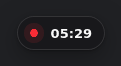
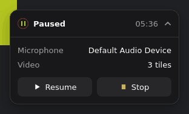
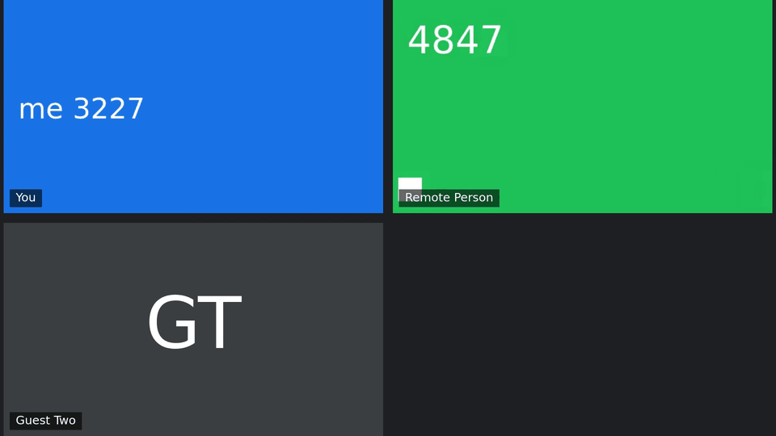

# Zen Recorder user guide

Everything Zen Recorder does, in more depth than the [README](../README.md). The README is the
short version: what it is, how to install it, what it records. This page is for when you want to
know exactly what happens: what the status card says, how files are named, what the meeting
notes hold, and what happens when something goes wrong.

- [Install and update](#install-and-update)
- [Recording a meeting](#recording-a-meeting): when it starts and stops, the status card, the
  toolbar popup, video, audio
- [Files](#files): where they go, their names, their size, playing them
- [Meeting notes](#meeting-notes)
- [When something goes wrong](#when-something-goes-wrong): a closed tab, a crash, an encoder
  failure, a full disk, an update mid-call, Diagnostics
- [Services](#services): Google Meet, Zoom, Microsoft Teams
- [Settings](#settings)
- [Privacy and storage](#privacy-and-storage)

## Install and update

Zen Recorder runs in Firefox 140 or later and in the browsers built on it (Zen, LibreWolf,
Floorp, Waterfox and others), on the desktop. Chrome, Edge and other Chromium-based browsers are
not supported, and neither is Firefox for Android.

### From Firefox Add-ons

1. Open [Zen Recorder on Firefox Add-ons](https://addons.mozilla.org/firefox/addon/zen-recorder/)
   and click **Add to Firefox**. Zen and the other Firefox-based browsers show the same button.
2. Accept the install prompt. It lists the sites the recorder works on (Google Meet, Zoom,
   Microsoft Teams); leave them all allowed.

### From GitHub Releases

Each release on GitHub carries the same signed add-on file as Firefox Add-ons, with the same
version: `zen-recorder-<version>.xpi`. Mozilla's add-on service checks and signs it, so it installs
in Firefox and in the browsers built on it.

1. Download `zen-recorder-<version>.xpi` from the
   [latest release](https://github.com/zenfully-org/zen-recorder/releases/latest).
2. Open the file in your browser: drag it onto a browser window, or open `about:addons`, click the
   gear icon and choose **Install Add-on From File…**.
3. Accept the install prompt, and leave all the sites it lists allowed.

**Zen:** the same steps, either way. You do not need to change any pref, because the file is
signed.

If the listing or the releases page is still empty, the first signed release is on its way:
Mozilla's review can take from minutes to a few days. You can build the extension from source
meanwhile ([CONTRIBUTING.md](../CONTRIBUTING.md)).

### Updates

Updates are automatic. The browser checks for a new version once a day and installs it, from
Firefox Add-ons, whichever way you installed it. Your settings and the list of recent recordings
are kept.

After an update the popup may show **Grant access** for a service that is new in that version:
Firefox asks for each site's permission separately. The popup shows the same button for a site
you left out at install or turned off later. Without that permission, Zen Recorder cannot see the
calls on that site.

**Coming from 0.3.0 or older:** the add-on id changed, so Firefox installs the new version as a
second add-on and carries nothing over. Follow the one-time steps for the new add-on id in
[CHANGELOG.md](../CHANGELOG.md) first.

## Recording a meeting

### When it starts and stops

- Zen Recorder detects when you are in a call and starts recording once you have been let in and
  someone else is there. Nothing is recorded on a pre-join screen, in a lobby or in a waiting
  room. **Settings → Start recording** can start it as soon as the call is connected, even alone,
  and **Record automatically** turned off leaves the start to you.
- It stops and saves when the call ends, or when you press Stop.
- Pause, Resume and Stop are on the status card on the meeting page and in the toolbar popup.
  `Alt+Shift+R` starts or stops the recording of the meeting in the current tab (change it in
  `about:addons` → the gear icon → **Manage Extension Shortcuts**).
- The file keeps the audio up to the moment you press Pause or Stop, even when the meeting page is
  busy, and nothing of a pause. On a busy page, saving starts a moment later.

### The status card

The status card on the meeting page stays out of the way: a small pill on the right edge, with a
dot that says whether it records and, while it does, how long it has run.

| Dot | Words | What it means |
|---|---|---|
| Red | **Recording** | Recording, with the time it has run. |
| Amber bars | **Paused** | Paused: nothing is recorded until you press Resume. |
| A turning ring | **Saving…** | The recording stopped and its file is being saved. |
| A grey ring | **Waiting to be admitted**, **Waiting for participants**, **Ready to record** | Not recording yet: you are in a lobby or a waiting room, you are alone in the call, or you can press Record. |
| An amber square | **Not recording** | Not recording until the add-on has taken what the page holds ([a full disk](#a-full-disk-or-a-disabled-add-on)), or after an encoder failed four times in a row (press Record to try again). |

- Click the card, or press Enter on it, for the details: the microphone, the video, and the
  Record, Pause, Resume and Stop buttons. Click again or press Escape to close them.
- Drag it anywhere. It comes back where you left it on that service (Meet, Zoom and Teams each
  keep their own place), after a reload and in later meetings, and stays inside the window when
  the window gets smaller.
- "Saved" and error messages appear next to it.
- It never takes the keyboard focus from the meeting, and keys pressed on it do not reach the
  meeting's shortcuts.
- **Settings → REC indicator** turns it off.

### The toolbar popup

The Zen Recorder button in the toolbar opens the popup:

- a card for each open meeting tab, with its state, the microphone, the video tiles, and
  **Record now**, **Pause**, **Resume** and **Stop & save**;
- the recent recordings, with their length, size and status, and **Show file**, **Retry save** or
  **Remove** where they apply;
- **Diagnostics**, which copies the log of what happened ([below](#diagnostics)), and
  **Settings**;
- **Grant access** when a meeting site's permission is missing.

### Video

- Video is on by default: 1080p, 15 fps, 2.5 Mbps, about 1.1 GB per hour. **Settings → Video**
  changes it or turns it off (audio only).
- It composites the meeting's own video tiles with name labels, including a shared screen, as they
  are laid out on the page, and keeps recording while the tab is in the background. Chat and
  captions panels are not captured.
- When the machine cannot keep up, the frame rate drops to 7.5 or 5 fps and comes back once the
  load allows. While nothing on screen changes (cameras off, a still slide) and the tab is in
  front, only about one frame per second is drawn and encoded.
- Video needs WebCodecs. With `privacy.resistFingerprinting` on (LibreWolf turns it on by
  default), Firefox hides WebCodecs from web pages, and recordings are audio only.

### Audio

- The recording holds everyone's audio and your microphone.
- Muting in the meeting mutes your microphone in the recording too, on every service.
- The recording follows the microphone the meeting has open: switching devices or running the
  service's microphone test keeps your voice in it.
- Audio and video stay in step for the whole call: the file follows the clock of the audio it
  records, and a busy tab that gets the audio late puts no gaps in it.
- The first second or so of a recording can be silent while the browser starts the recorder's
  audio.

## Files

Recordings go to `Downloads/zen-recorder/YYYY-MM-DD_HH-mm_<meeting title>.webm`, in your
browser's download folder. **Settings → Files** changes the subfolder and the file name template.

- The template's tokens are `{date}`, `{time}`, `{title}`, `{code}` (the meeting's id) and
  `{provider}` (`meet`, `zoom` or `teams`). The default is `{date}_{time}_{title}`.
- A name that is already taken gets `(1)`, `(2)`… before the extension: for example two tabs of
  one meeting, or two meetings with the same title started in the same minute. Files are saved one
  at a time, so recordings that end together are all kept.
- A name keeps the title's letters and emoji but drops what Firefox does not allow in a file name
  (invisible marks such as right-to-left marks or the joiner inside some emoji, control
  characters), and stops at 80 characters. If Firefox still refuses a name, the recording is saved
  as `YYYY-MM-DD_HH-mm_recording.webm`, and Diagnostics say why.
- A subfolder name that ends in `.lnk`, `.local`, `.url`, `.scf` or `.desktop` gets an `_` for its
  last dot (`meetings.local` becomes `meetings_local`): Firefox does not accept such a folder name.
- A recording stopped before anything was recorded (Record and Stop at once) leaves no file. The
  popup lists it as failed with "nothing was recorded" and offers only **Remove** (a retry could
  only refuse again), and Diagnostics say so too.
- Next to each recording, its [meeting notes](#meeting-notes) have the same name with `.md`,
  `(1)` included.

### Size and format

WebM, seekable: video in VP9, audio in Opus. With video, about 1.1 GB per hour; audio only (Opus
64 kbps), about 30 MB per hour.

### Playing a recording

VLC and every browser play the WebM files as they are. Windows Media Player needs the free
"VP9 Video Extensions" and "Web Media Extensions" from the Microsoft Store.

## Meeting notes

Every saved recording gets a Markdown file with the same name next to it: `Weekly sync.webm` and
`Weekly sync.md`, or `Weekly sync(1).md` beside `Weekly sync(1).webm`.

- It says what the meeting was (its service, title, link and date), when the recording started
  and stopped and why, and how long it is, with every event at its position in the recording, so
  a reader can seek to it.
- It also says what it does not know: a recording recovered after a crash has an estimated end,
  and a meeting tab opened before an update sends no events until it is reloaded.
- Who took part, people joining and leaving, and screen sharing come next. Follow the work in the
  [`meeting-notes` issues](https://github.com/zenfully-org/zen-recorder/issues?q=label%3Ameeting-notes).
- The file holds one machine-readable block in a versioned, documented format
  ([`meeting-notes-format.md`](meeting-notes-format.md)), so an AI assistant or another tool can
  parse it.
- **Settings → Meeting notes** chooses **Off** (no file), **Timeline only (no names)**, or
  **Timeline and participant names** (the default). The meeting's title is kept in every mode.
- The notes are written on your computer, like the recording, and sent nowhere.
- When a notes file cannot be saved, the recording stays saved, and Diagnostics say why.

## When something goes wrong

Zen Recorder is built never to lose a meeting. Audio and video are kept every few seconds
(**Settings → Advanced → Chunk interval**, 3 seconds by default) while the call goes on.

### A closed tab, a crash

- Closing the meeting tab or leaving the page ends the recording. The file is saved within
  seconds under its usual name, without the last second or two the tab had not handed over yet.
- A crashed tab still yields a `(recovered)` file about 10 seconds later, and a browser crash one
  the next time the browser starts.
- If even that cannot be stored (a full disk), the popup says "not saved yet (tab closed)" a
  minute later and offers **Retry save**. A retried save keeps `(recovered)` in the name.

### An encoder failure

- When the encoder fails mid-call, the file so far is saved and the recording goes on in a new
  file (audio only if the video was the problem), which starts at once, even while the add-on
  cannot take the recording.
- If you had paused, it stays paused: nothing is recorded until you press Resume, which starts the
  new file.
- An encoder that fails four times in a row is not restarted again: the status card and the popup
  say "Recording failed", and Record tries again.

### A full disk, or a disabled add-on

When the add-on cannot take the recording for minutes (a full disk, or the add-on disabled during
a call), the meeting page keeps every part of it:

- It holds at most 64 MiB of video recordings, about 3.5 minutes, and 64 MiB of audio-only ones,
  however many files that is.
- Past that, the video stops and the call goes on as audio only, in a new file, which takes 40
  times less, until the add-on has taken the video part and keeps up again: then the video comes
  back, in another new file.
- When the audio-only part fills up too, recording stops until the add-on has taken it.
- While that lasts, the status card says so in amber words, **Audio only** or **Waiting for
  space**, its details say what happened, and a message next to it tells you the first time. The
  popup's card for that meeting says the same. The words go once the add-on has taken what the
  page held.
- A recording that ends and starts again meanwhile (an encoder error, Stop then Record, a new
  meeting in the same tab) goes on at once in a new file.
- Every file is saved whole once the add-on is back, even when it restarted meanwhile, and the
  Diagnostics log says why each one stopped.
- When the disk is full, the meeting tab that records says so in an error message next to its
  status card, once, so you can free some space before the video stops. It says so again only if
  saving worked in between.

### An update or a reload in the middle of a call

Zen Recorder survives extension reloads and updates mid-call: the recorder inside the page keeps
going and the file stays whole, even when the update comes just as the recording stops. The file
is still saved under its own name.

### Diagnostics

The popup's **Diagnostics** button copies a log of what happened, for bug reports. It includes
what the video costs on this machine ("video perf" lines) and how the audio keeps time ("audio
clock" lines). The log names your recordings' files, and so their meeting titles: read it before
you share it.

## Services

| Service | Where it works | Notes |
|---|---|---|
| Google Meet | `meet.google.com` | The reference implementation; live-tested with two participants and a shared screen. |
| Zoom | the web client (`app.zoom.us/wc/…`, "Join from browser"); not the desktop app | Join the meeting's audio ("Join Audio by Computer") or there is nothing to record. While the Zoom tab is in the background Zoom stops showing your own camera, so the recording shows initials for that time (audio is unaffected). The recording ends when you leave or when the host ends the meeting (then about 5 seconds later, or as soon as you click OK). Closing the tab ends it too. Live-tested with two participants, a screen share and the waiting room. |
| Microsoft Teams | `teams.microsoft.com`, `teams.live.com`, `teams.cloud.microsoft` | Signed-in calls have no meeting id in the address: `{code}` in the file name template is `teams-call` for them (the default template uses the title). Live-tested up to the lobby so far; the in-call test is pending. |

> [!IMPORTANT]
> This records other people without any browser-level indicator. Many jurisdictions require
> all-party consent. Tell the people in your call.

## Settings

The popup's **Settings** button opens them. Changes apply at once, open meeting tabs included.

| Setting | Default | What it does |
|---|---|---|
| Recording → Record automatically | on | Starts recording when you join a call. Off: press Record on the status card or in the popup. |
| Recording → Start recording | when the first other participant's audio arrives | Starts once you have been let in and someone else is there. The other choice starts as soon as the call is connected, even alone. |
| Recording → Audio quality (Opus) | 64 kbps | 32 to 128 kbps. |
| Recording → REC indicator | on | Shows the status card on the meeting page. |
| Video → Record video | on | Off records audio only. |
| Video → Resolution, Frame rate, Video quality (VP9) | 1080p, 15 fps, 2.5 Mbps | Lower values make smaller files; a lower frame rate uses less CPU on the meeting tab. |
| Video → Name labels | on | Draws the participants' names on the tiles. |
| Video → Keep tiles updating in background tabs (experimental) | off | Makes the meeting page believe its tab is visible while recording. |
| Files → Subfolder inside Downloads | `zen-recorder` | Where the files go, inside the browser's download folder. |
| Files → Filename template | `{date}_{time}_{title}` | See [Files](#files). |
| Meeting notes → Notes file | Timeline and participant names | Or Timeline only (no names), or Off. |
| Advanced → Chunk interval (seconds) | 3 | How often audio is persisted. Smaller loses less on a crash. |
| Advanced → Keep raw copy | off | Also saves the untouched MediaRecorder output, for debugging. |

## Privacy and storage

- Zen Recorder records the audio and video of the meetings you take part in, on the services
  above, and saves them as files in your Downloads folder.
- While a recording runs, its pieces are kept in the browser's own storage (IndexedDB) so that a
  crash loses nothing. They are deleted once the file is saved. Pieces of a recording whose start
  never reached Zen Recorder cannot become a file; they are deleted a day after the last one
  arrived. The popup's list of recent recordings (file names, sizes, status) stays in the
  extension's storage.
- The meeting notes are files next to the recordings. Until a notes file is written, what it will
  say waits in the same storage, and is deleted once the file is saved. Settings can leave the
  participants' names out of the notes, or turn the notes off.
- It sends nothing anywhere: no servers, no accounts, no analytics, no crash reports. The
  extension's manifest declares that it collects no data.
- The Diagnostics log stays in the browser. The popup's **Diagnostics** button copies it to your
  clipboard only when you press it. The log names your recordings' files, and so their meeting
  titles: read it before you share it.
- Asking the other people in the call for their consent is up to you (see the note under
  [Services](#services)).

The [privacy policy](https://zenfully-org.github.io/zen-recorder/privacy.html) says all of this in
full (its source is [`docs/store/privacy.md`](store/privacy.md)).
